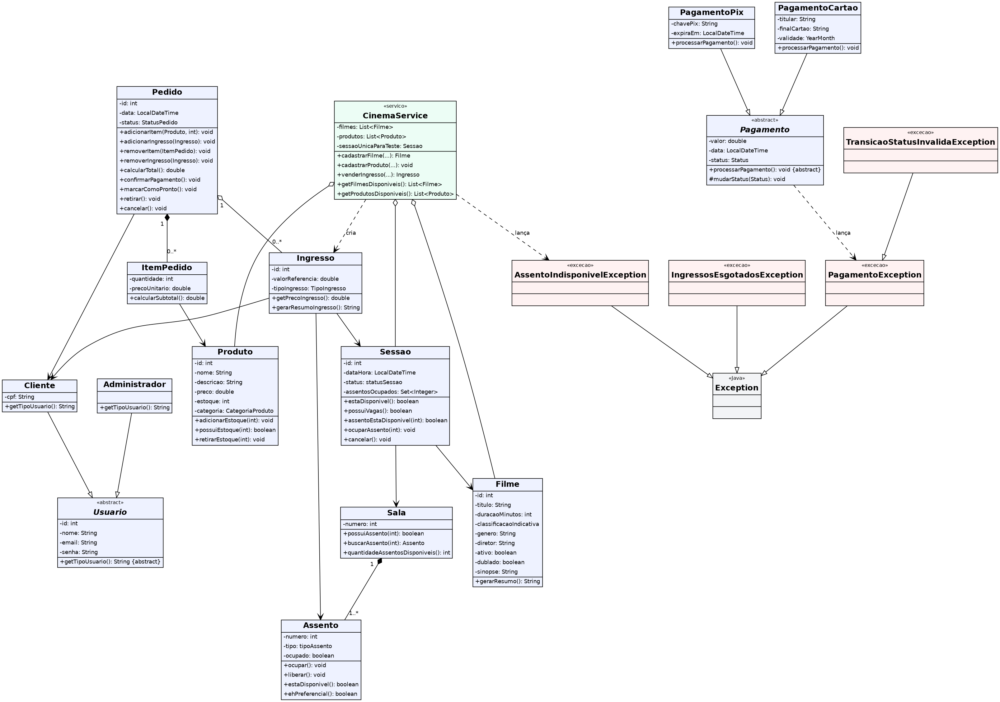
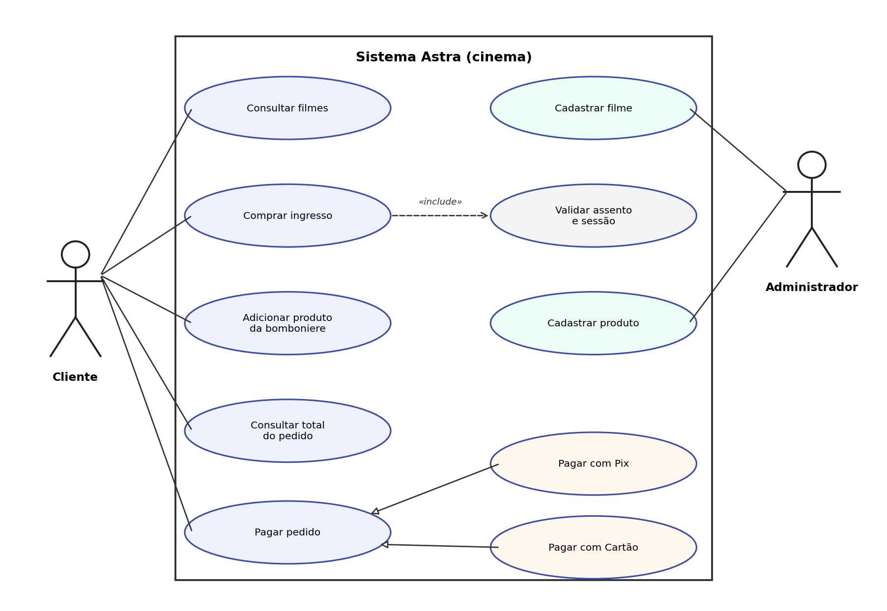
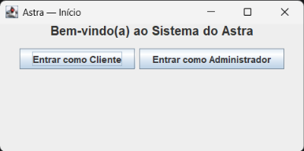
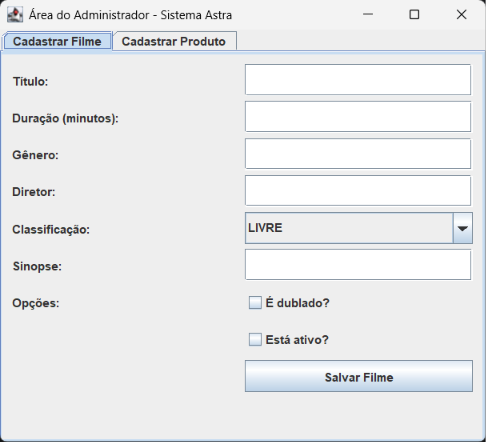
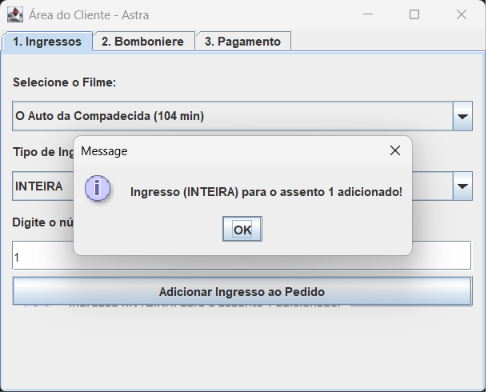
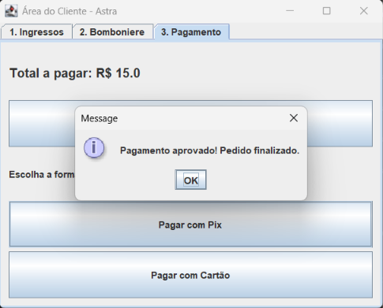
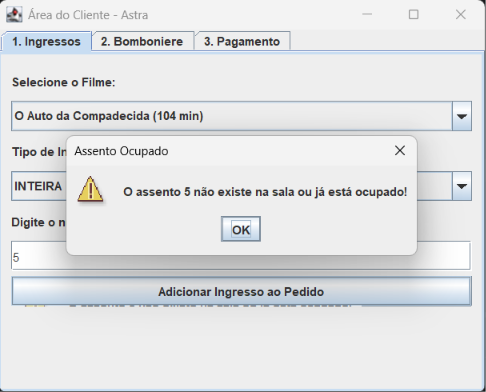

Bem-vindo ao repositório do **Grupo 7** para a disciplina de Programação Orientada a Objetos.

Nosso projeto é o Astra: um sistema de gerenciamento e compra online para um cinema. O cliente pode consultar filmes e sessões disponíveis, selecionar assentos, comprar ingressos e adquirir produtos da bomboniere. O pagamento é realizado pelo sistema e os produtos e ingressos são retirados presencialmente no cinema. Funcionários administradores podem cadastrar filmes e produtos da bomboniere. Nesta versão, a sala e a sessão de exibição são pré-cadastradas no `CinemaService` para a demonstração.

---

## Integrantes do Grupo

* **Bruna Rosa Ferreira** — brunarf.aluno@unipampa.edu.br — [GitHub](https://github.com/eumuno)
* **Erik Bruckmann Soares** — eriksoares.aluno@unipampa.edu.br — [GitHub](https://github.com/Erikbruckmann1)
* **Gabriela Muniz Barreto** — gabrielamuniz.aluno@unipampa.edu.br — [GitHub](https://github.com/gabrielamnzb)
* **Isabeli Souza da Rosa** — isabelirosa.aluno@unipampa.edu.br — [GitHub](https://github.com/beliisa2626)
* **Katiane Gamarra Olegário** — katianeolegario.aluno@unipampa.edu.br — [GitHub](https://github.com/katianeG)

---

## Estrutura de Pastas do Repositório

A organização física das pastas do repositório segue as recomendações de boas práticas de engenharia de software:

```
poo-astra/
├── README.md                   # Esta página inicial do projeto.
├── docs/                       # Pasta para documentos gerais.
├── diagramas/                  # Pasta para os diagramas UML.
└── src/                        # Pasta raiz do código-fonte.
    └── astra/                  
        ├── modelo/             # Classes de domínio.
        ├── servico/            # Regras de negócio e lógicas do sistema.
        ├── excecoes/           # Classes de erros personalizados do domínio.
        └── interfacegrafica/   # Telas desenvolvidas em Java Swing.              
```
## Instruções para Executar o Projeto

Para testar o sistema Astra localmente, siga os passos abaixo:
1. Faça o clone deste repositório em sua máquina.
2. Tenha o **JDK 11 ou superior** instalado.
3. Abra o projeto em sua IDE de preferência (IntelliJ IDEA, Eclipse ou NetBeans), marcando a pasta `src` como raiz do código-fonte.
4. Execute a classe `astra.Main` (arquivo `src/astra/Main.java`).
5. A tela inicial (`AstraFrame`) será aberta. Você pode navegar entre a Área do Administrador (para cadastrar Filmes e Produtos) e a Área do Cliente (para simular uma compra completa de ingressos e produtos da bomboniere, finalizando no pagamento).

## Identificação das Classes Principais

O nosso domínio foi modelado para refletir a realidade de um cinema. As classes principais estão divididas em:

* **Atores:** `Usuario` (abstrata), `Cliente` e `Administrador`. Representam quem interage com o sistema.
* **Cinema:** `Filme`, `Sessao`, `Sala` e `Assento`. Representam a estrutura física e a programação.
* **Vendas:** `Produto`, `ItemPedido`, `Pedido` e `Ingresso`. Representam o ciclo de compras do cliente.
* **Pagamento:** `Pagamento` (abstrata), `PagamentoPix` e `PagamentoCartao`. Representam as diferentes formas de processar o acerto financeiro do pedido.
* **Serviço Central:** `CinemaService`. Classe que atua como o coordenador do caso de uso, validando regras de negócio e armazenando os dados em listas na memória para a execução do sistema.

## Explicação Breve das Regras de Negócio

O sistema não é apenas um cadastro; ele protege ativamente as seguintes regras de negócio:
* **Controle de Vagas:** Um assento não pode ser vendido se já estiver ocupado (dispara `AssentoIndisponivelException`).
* **Validação de Sessão:** O sistema impede a venda de ingressos para sessões que não estejam disponíveis (dispara `IllegalStateException`).
* **Imutabilidade do Pedido:** Um pedido vazio não pode ser pago, e um pedido que já foi finalizado não pode ter seu status alterado livremente ou ser cancelado diretamente de forma indevida.
* **Regras de Pagamento:** Cartões com `YearMonth` de validade expirada são automaticamente recusados, e transações Pix fora do prazo expiram, bloqueando a transição de status (dispara `PagamentoException`).

## Checklist de Avaliação

Abaixo, detalhamos onde cada conceito exigido foi aplicado no nosso sistema:

| Conceito | O que deve ser demonstrado | Como o projeto cumpriu o item |
|---|---|---|
| Classes e objetos Java | Classes coerentes e instanciação de objetos do domínio | Instanciação de `Filme`, `Cliente`, `Produto` e `Ingresso` nas operações do sistema. |
| Atributos de classe Java | Estado relevante armazenado nos objetos | Atributos como `titulo` e `duracaoMinutos` em `Filme`, e `estoque` em `Produto`. |
| Métodos de classe Java | Comportamentos associados às classes corretas | Métodos como `calcularTotal()` no `Pedido` e `ocupar()` no `Assento`. |
| Construtores em Java | Inicialização obrigatória e criação de objetos válidos | Construtores de `Filme`, `Usuario` e `Sessao` exigem a passagem dos dados obrigatórios na sua criação. |
| Palavra-chave `this` | Referência inequívoca ao objeto atual | Utilizado amplamente nos construtores (ex: `this.nome = nome`) para diferenciar atributos de parâmetros. |
| Modificadores Java | Visibilidade adequada de classes, atributos e métodos | Atributos declarados como `private` (e `final` para imutabilidade no `ItemPedido`), expondo apenas `public getters`. |
| Encapsulamento em Java | Proteção do estado e alterações por métodos controlados | O atributo `ocupado` de `Assento` não pode ser alterado externamente, apenas pelo método `ocupar()`. |
| Pacotes Java / API | Organização do código por responsabilidade | Código rigorosamente dividido em `modelo`, `servico`, `excecoes` e `interfacegrafica`. |
| Herança em Java | Especialização coerente de um conceito geral | `Cliente` e `Administrador` estendem `Usuario`; `PagamentoPix` e `PagamentoCartao` estendem `Pagamento`. |
| Polimorfismo em Java | Uso do tipo geral para manipular objetos diferentes | Em `TelaCliente`, o método `processarPagamentoPolimorfico(Pagamento)` recebe o tipo geral e chama `processarPagamento()`, sem saber se é `PagamentoPix` (valida o prazo de 10 minutos) ou `PagamentoCartao` (valida a validade do cartão). |
| Palavra-chave `super` | Reaproveitamento da inicialização ou comportamento da superclasse | Construtores de `Cliente`, `Administrador` e `PagamentoCartao` chamam `super(...)` para aproveitar os dados da classe mãe. |
| Abstração em Java | Representação de um conceito geral que não deve ser instanciado diretamente | As classes `Usuario` e `Pagamento` foram declaradas como `abstract`. |
| Interfaces em Java | Contrato com implementações substituíveis | Não criamos uma `interface` própria: o contrato substituível do domínio foi representado pela classe abstrata `Pagamento`, pois Pix e Cartão compartilham estado (valor, data, status). Usamos interfaces da API Java, como `List` e `Set`. Uma evolução natural seria extrair uma `PoliticaPreco` para os tipos de ingresso. |
| Enum em Java | Conjunto fechado de valores válidos | Uso extensivo para segurança de estado: `TipoIngresso`, `StatusPedido`, `Pagamento.Status`, `statusSessao`, `tipoAssento`, `classificacaoIndicativa` e `CategoriaProduto`. |
| Tratamento de exceções em Java | Lançamento e tratamento adequado de erros, incluindo exceções próprias do domínio | Criação das exceções `AssentoIndisponivelException` e `PagamentoException`, lançadas pelo domínio e capturadas/exibidas via `try-catch` no Java Swing. |
| Interface gráfica com Swing | Interface mínima funcional para entrada, execução de operações e apresentação de resultados | Telas completas (`AstraFrame`, `TelaCliente`, `TelaAdmin`) usando `JFrame`, `JComboBox`, `JTextField` e exibições amigáveis via `JOptionPane`. |
| Data e hora em Java | Uso da API `java.time` | Uso de `LocalDateTime` para a data/hora da `Sessao` e do `Pedido`, e `YearMonth` para a validade do `PagamentoCartao`. |

## Diagramas

Os diagramas UML estão na pasta [`diagramas/`](diagramas/).

**Diagrama de classes**



**Diagrama de casos de uso**



## Demonstração da Interface Gráfica

Capturas de tela do sistema em funcionamento (pasta [`docs/prints/`](docs/prints/)):

| Tela inicial | Área do Administrador |
|---|---|
|  |  |

| Compra de ingresso | Pagamento |
|---|---|
|  |  |

| Erro tratado (assento ocupado) |
|---|
|  |
